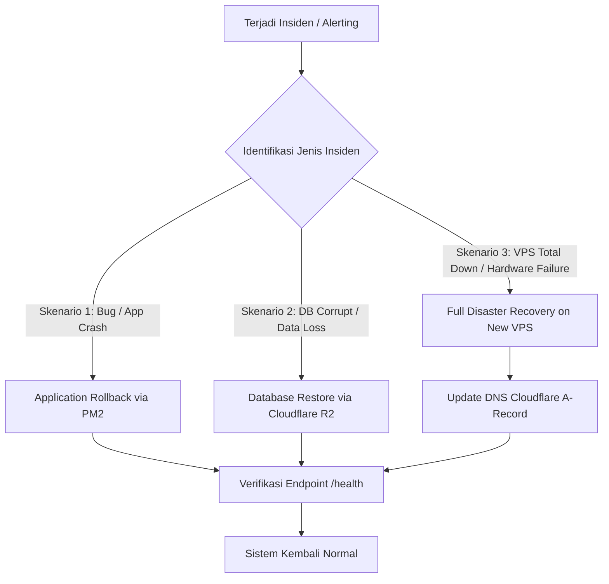

# Disaster Recovery Plan (DRP): April Eyewear Infrastructure

Dokumen Rencana Pemulihan Bencana (*Disaster Recovery Plan*) resmi untuk infrastruktur April Eyewear. Menetapkan protokol operasional darurat, target pemulihan (RTO & RPO), serta langkah pemulihan langkah-demi-langkah jika terjadi insiden kritis pada server VPS maupun basis data.

---

## 1. Parameter Target Pemulihan (RPO & RTO)

| Metrik | Definisi | Target April Eyewear | Penjelasan |
| :--- | :--- | :--- | :--- |
| **RPO** *(Recovery Point Objective)* | Toleransi maksimal data transaksi yang hilang | **≤ 24 Jam** *(Daily Snapshot)*<br>**≤ 1 Jam** *(Peak Campaign)* | Ditentukan oleh frekuensi snapshot database harian ke Cloudflare R2. |
| **RTO** *(Recovery Time Objective)* | Waktu maksimal dari insiden hingga sistem kembali online | **≤ 30 Menit** | Waktu yang dibutuhkan untuk provisioning VPS baru, restore DB, dan deploy aplikasi. |

---

## 2. Matriks Skenario Bencana & Prosedur Respon



---

## 3. Prosedur Skenario 1: Kerusakan / Kesalahan Data (Database Restore)

Digunakan ketika data database terhapus tidak sengaja (*human error*) atau data corrupt, namun VPS masih berjalan normal.

### Langkah Operasional Cepat:
Gunakan skrip otomatis dari mesin lokal Anda:

```bash
# 1. Restore ke database Production dari file snapshot R2 terbaru
./scripts/restore-db.sh prod latest

# 2. Atau restore file spesifik:
./scripts/restore-db.sh prod april_eyewear_db_20260922_020000.sql.gz
```

### Langkah Manual di Dalam VPS:
Jika dilakukan secara manual via SSH:
```bash
# 1. Masuk ke VPS
ssh -p 22 ubuntu@<IP_VPS>

# 2. Hentikan aplikasi sementara agar tidak ada transaksi masuk
pm2 stop all

# 3. Putus seluruh koneksi aktif ke PostgreSQL
sudo -u postgres psql -c "
SELECT pg_terminate_backend(pid) 
FROM pg_stat_activity 
WHERE datname = 'april_eyewear_db' AND pid <> pg_backend_pid();"

# 4. Drop dan Re-create Database Bersih
sudo -u postgres dropdb april_eyewear_db
sudo -u postgres createdb april_eyewear_db -O postgres

# 5. Restore dari file backup
gunzip -c /tmp/backups/april_eyewear_db_latest.sql.gz | sudo -u postgres psql april_eyewear_db

# 6. Jalankan kembali aplikasi
pm2 restart all
pm2 status
```

---

## 4. Prosedur Skenario 2: VPS Total Down / Kerusakan Hardware (Full Server Loss)

Digunakan jika server VPS saat ini mengalami kegagalan hardware permanen, data center terbakar/mati total, atau terkena ransomware.

### Waktu Estimasi Pemulihan: ~20-25 Menit

#### Langkah 1: Sewa VPS Baru (5 Menit)
- Sewa VPS baru di provider (DigitalOcean / Hetzner / AWS / Linode / Biznet Gio).
- Pilih OS: **Ubuntu 22.04 / 24.04 LTS**.
- Catat **IP Publik Baru** (misal: `103.175.xxx.xxx`).

#### Langkah 2: Jalankan Initial Provisioning (7 Menit)
Login ke VPS baru sebagai root, lalu jalankan skrip setup otomatis:
```bash
# Download skrip setup dari repositori vps-config
curl -fsSL https://raw.githubusercontent.com/ryanakbar20/april-eyewear-vps-config/main/scripts/setup-vps.sh | sudo bash -s prod
```
*Skrip akan otomatis memasang Node.js 20, PM2, PostgreSQL 16, Nginx, Swap 4GB, dan firewall UFW.*

#### Langkah 3: Update Konfigurasi Lokal & Pulihkan Database (5 Menit)
1. Buka file `.env` di komputer lokal:
   ```ini
   PROD_VPS_IP=103.175.xxx.xxx   # Ganti ke IP VPS baru
   ```
2. Pulihkan data transaksi dari Cloudflare R2 ke VPS baru:
   ```bash
   ./scripts/restore-db.sh prod latest
   ```

#### Langkah 4: Deploy Aplikasi ke VPS Baru (3 Menit)
Jalankan 1-click deployment dari komputer lokal:
```bash
./scripts/deploy.sh prod
```

#### Langkah 5: Salin & Aktifkan Konfigurasi Nginx (2 Menit)
```bash
# Kirim file Nginx ke server baru
scp prod/nginx-prod.conf ubuntu@103.175.xxx.xxx:/tmp/nginx-prod.conf

ssh ubuntu@103.175.xxx.xxx << 'EOF'
  sudo mv /tmp/nginx-prod.conf /etc/nginx/sites-available/api.aprileyewear.com
  sudo ln -sf /etc/nginx/sites-available/api.aprileyewear.com /etc/nginx/sites-enabled/
  sudo nginx -t
  sudo systemctl reload nginx
EOF
```

#### Langkah 6: Alihkan DNS di Cloudflare Dashboard (1 Menit)
1. Buka [Cloudflare Dashboard](https://dash.cloudflare.com) > DNS Records.
2. Edit DNS record `api.aprileyewear.com` (A Record).
3. Ubah IP lama ke **IP VPS Baru** (`103.175.xxx.xxx`).
4. Klik **Save**. Karena menggunakan Cloudflare Proxy, perubahan IP terjadi secara **instan (< 30 detik)** di seluruh dunia tanpa menunggu propagasi ISP!

---

## 5. Prosedur Skenario 3: Rollback Aplikasi Pasca-Rilis (Bad Deployment)

Digunakan ketika rilis fitur baru menyebabkan *fatal error* atau *infinite loop*, sementara basis data tidak mengalami kerusakan.

```bash
# 1. Rollback via Git & PM2 dari mesin lokal
cd ../april-eyewear-main-service
git checkout HEAD~1        # Kembali ke commit stabil sebelumnya
npm run build

# 2. Deploy ulang versi stabil
cd ../april-eyewear-vps-config
./scripts/deploy.sh prod
```

---

## 6. Jadwal Uji Coba Pemulihan Berkala (Drill Schedule)

Untuk memastikan seluruh skrip dan backup R2 bekerja secara nyata, tim teknis wajib melakukan simulasi pemulihan berkala:

| Jenis Pengujian | Frekuensi | Prosedur | Penanggung Jawab |
| :--- | :--- | :--- | :--- |
| **Uji Integritas File R2** | Setiap Minggu | Verifikasi ukuran file `.sql.gz` di bucket R2 tidak 0 bytes | Lead DevOps |
| **Simulasi Restore ke Dev VPS** | 1x Setiap Bulan | Jalankan `./scripts/restore-db.sh dev latest` dan pastikan seluruh data terbaca di Swagger/Admin | Backend Lead |
| **Audit Akses Kredensial R2** | 1x Setiap 3 Bulan | Rotasi API Token Cloudflare R2 dan perbarui file `.env` | System Administrator |

---

## 7. Kontak Kritis & Jalur Eskalasi Insiden

- **Lead Engineer / DevOps:** Ryan Akbar (`admin@aprileyewear.com`)
- **Cloudflare Console:** [https://dash.cloudflare.com](https://dash.cloudflare.com)
- **Payment Gateway Status (iPaymu):** [https://status.ipaymu.com](https://status.ipaymu.com)
- **Kurir & Logistik API (Biteship):** [https://dashboard.biteship.com](https://dashboard.biteship.com)
